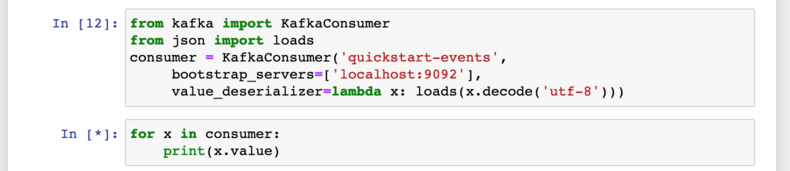

We will start with a python and ML agnostic component of our streaming ML model deployment workflow.

### Apache Kafka

 - Is a popular Java/Scala based OSS (open-source software) streaming solution that allows one to stream messages. These messages can be streamed to and from various end-points. 

 - See the [Github repo](https://github.com/apache/kafka) for the code and  [wikipedia](https://en.wikipedia.org/wiki/Apache_Kafka) for its history. It started out of LinkedIn in 2011.

 - From its [webpage](https://kafka.apache.org/),

> Apache Kafka is an open-source distributed event streaming platform used by thousands of companies for high-performance data pipelines, streaming analytics, data integration, and mission-critical applications. 


<div style="text-align: right"> Source: https://kafka.apache.org/ </div>

### Architecture

 - We will not go into the technical details of the software here. Instead, we will familiarize ourselves with some of its building blocks.
 
 - First is the notion of producers and consumers of messages.

 - These producers and consumers are arbitrary programs (e.g., pyspark in our case).

 - The messages produced by producers are partitioned into *topics*. Within a topic, the messages are stored in ways that maximize I/O and network efficiency.

 - Consumers read from these topics, and thus partitions. 

 - The messages in the topics typically have constraints (older messages will be deleted or only the most recent messages will be retained).
 - The messages can be read many times by many consumers as long as the constraints are met.

 - The manageemnt of topics,partitions and messages happens on *brokers* (essentially nodes of a cluster). For instance, partitions are copied and synced on multiple brokers for redundancy.


<div style="text-align: right"> Source: https://upload.wikimedia.org/wikipedia/commons/6/64/Overview_of_Apache_Kafka.svg</div>


### Setup

 - We will set up Kafka on a local dev machine (e.g., AWS EC2/your laptop) and create a topic to which producers can send messages to and consumers can read messages from.
 - Typically it needs one to build out a cluster ourselves and manage it. There are managed solutions by cloud vendors that help you with this.

#### Lets spin up a VM

 -  We will use Vultr VPS that we have used before. We could also use AS EC2 or GCP Cloud Instances. 
 - Below are the screenshots of the process.


 - Given the details, log into the machine. Copy your ssh keys if needed and change the access to a password less access.

```bash
(datasci-dev) ttmac:mlops theja$ ssh root@155.138.192.245
root@vultr:~# pwd
root@vultr:~# mkdir .ssh
root@vultr:~# cd .ssh/
root@vultr:~# vim authorized_keys #paste your id_rsa.pub or other SSH key file
root@vultr:~# vim /etc/ssh/sshd_config #change line 58 or nearby by removing # and setting `no`: PasswordAuthentication no
root@vultr:~# sudo systemctl restart ssh
root@vultr:~# apt install fail2ban
root@vultr:~# ufw allow 22
root@vultr:~# ufw enable
Command may disrupt existing ssh connections. Proceed with operation (y|n)? y
Firewall is active and enabled on system startup
root@vultr:~# ufw status verbose
Status: active
Logging: on (low)
Default: deny (incoming), allow (outgoing), disabled (routed)
New profiles: skip

To                         Action      From
--                         ------      ----
22                         ALLOW IN    Anywhere
22 (v6)                    ALLOW IN    Anywhere (v6)

root@vultr:~#
```

 - We have discussed these steps and others while investigating ML hosted deployment on VMs/VPSs. The above instructions are minimal to get started with a somewhat secure machine.

 - Next we will follow the quickstart guide here: [https://kafka.apache.org/quickstart](https://kafka.apache.org/quickstart)

 - Install java runtime.

```bash
root@vultr:~# apt install openjdk-8-jre-headless
root@vultr:~# java -version
openjdk version "1.8.0_265"
OpenJDK Runtime Environment (build 1.8.0_265-8u265-b01-0ubuntu2~20.04-b01)
OpenJDK 64-Bit Server VM (build 25.265-b01, mixed mode)
```

 - Download Kafka and unzip it

```bash
root@vultr:~# wget http://mirror.cc.columbia.edu/pub/software/apache/kafka/2.6.0/kafka_2.13-2.6.0.tgz
--2020-10-08 17:46:46--  http://mirror.cc.columbia.edu/pub/software/apache/kafka/2.6.0/kafka_2.13-2.6.0.tgz
Resolving mirror.cc.columbia.edu (mirror.cc.columbia.edu)... 128.59.59.71
Connecting to mirror.cc.columbia.edu (mirror.cc.columbia.edu)|128.59.59.71|:80... connected.
HTTP request sent, awaiting response... 200 OK
Length: 65537909 (63M) [application/x-gzip]
Saving to: ‘kafka_2.13-2.6.0.tgz’

kafka_2.13-2.6.0.tg 100%[===================>]  62.50M  11.1MB/s    in 14s

2020-10-08 17:47:01 (4.44 MB/s) - ‘kafka_2.13-2.6.0.tgz’ saved [65537909/65537909]
root@vultr:~# ls
kafka_2.13-2.6.0.tgz
root@vultr:~# tar -xzf kafka_2.13-2.6.0.tgz
root@vultr:~# cd kafka_2.13-2.6.0
root@vultr:~/kafka_2.13-2.6.0#
```

 - We will also get into a screen session:

```bash
root@vultr:~/kafka_2.13-2.6.0# screen -list
No Sockets found in /run/screen/S-root.

root@vultr:~/kafka_2.13-2.6.0# screen -S kafka
```

 - Next lets start a service called `zookeeper`. This is a distributed configuration and synchronization service. We won't worry about it, and it will be removed from kafka as a dependency soon.

```bash
root@vultr:~/kafka_2.13-2.6.0# bin/zookeeper-server-start.sh config/zookeeper.properties
[2020-10-08 17:50:09,690] INFO Reading configuration from: config/zookeeper.properties (org.apache.zookeeper.server.quorum.QuorumPeerConfig)
[2020-10-08 17:50:09,696] WARN config/zookeeper.properties is relative. Prepend ./ to indicate that you're sure! (org.apache.zookeeper.server.quorum.QuorumPeerConfig)
[2020-10-08 17:50:09,706] INFO clientPortAddress is 0.0.0.0:2181 (org.apache.zookeeper.server.quorum.QuorumPeerConfig)
.
.
(truncated)
.
.
```

 - In a different terminal in the same screen session (Ctrl+a Ctrl+c, Ctrl+a n/p to navigate), run the Kafka broker service:

```bash
root@vultr:~/kafka_2.13-2.6.0# bin/kafka-server-start.sh config/server.properties #you may have to edit the kafka-server-start.sh to reduce the heap size. 
```

 - In a third terminal, lets create a topic. A topic is like a folder and events/messages/records can be considered as files.

```bash
root@vultr:~/kafka_2.13-2.6.0# bin/kafka-topics.sh --create --topic quickstart-events --bootstrap-server localhost:9092
Created topic quickstart-events.
```

 - We can also get a descirption of the currently created topic (such as replication, number of partitions etc):


```bash
root@vultr:~/kafka_2.13-2.6.0# bin/kafka-topics.sh --describe --topic quickstart-events --bootstrap-server localhost:9092
Topic: quickstart-events        PartitionCount: 1       ReplicationFactor: 1   Configs: segment.bytes=1073741824
        Topic: quickstart-events        Partition: 0    Leader: 0       Replicas: 0     Isr: 0
```

 - Lets write some events and read some events next. We will then hook this up with our Databricks spark environment in the next section.

 - If we execute the following in a new terminal, we can create events as strings (one per line). We can stop by using `Ctrl+c`.

```bash
root@vultr:~/kafka_2.13-2.6.0# bin/kafka-console-producer.sh --topic quickstart-events --bootstrap-server localhost:9092
>Hello
>Theja
>
```
 - We can then read these events from Kafka in yet another terminal.

```bash
root@vultr:~/kafka_2.13-2.6.0# bin/kafka-console-consumer.sh --topic quickstart-events --from-beginning --bootstrap-server localhost:9092
Hello
Theja

```

 - We can switch back to the producer terminal and add more events and experiment with this.

 - Next, lets do the same as above but with a jupyter notebook. We will port forward so we can access jupyter locally. For a change, we will not use conda below.

 - Install python and pip.

```bash
root@vultr:~/kafka_2.13-2.6.0#  apt-get update && apt install -y python3-pip python3-dev
root@vultr:~/kafka_2.13-2.6.0# pip3 install --upgrade pip
Collecting pip
  Downloading pip-20.2.3-py2.py3-none-any.whl (1.5 MB)
     |████████████████████████████████| 1.5 MB 11.8 MB/s
Installing collected packages: pip
root@vultr:~/kafka_2.13-2.6.0# python3 --version
Python 3.8.5
root@vultr:~/kafka_2.13-2.6.0# pip --version
pip 20.2.3 from /usr/local/lib/python3.8/dist-packages/pip (python 3.8)
root@vultr:~/kafka_2.13-2.6.0# pip3 --version
pip 20.0.2 from /usr/lib/python3/dist-packages/pip (python 3.8)
```


 - Install virtualenv.

```bash
root@vultr:~/kafka_2.13-2.6.0# pip3 install virtualenv
Collecting virtualenv
  Downloading virtualenv-20.0.33-py2.py3-none-any.whl (4.9 MB)
     |████████████████████████████████| 4.9 MB 16.3 MB/s
Collecting distlib<1,>=0.3.1
  Downloading distlib-0.3.1-py2.py3-none-any.whl (335 kB)
     |████████████████████████████████| 335 kB 21.0 MB/s
Requirement already satisfied: six<2,>=1.9.0 in /usr/lib/python3/dist-packages (from virtualenv) (1.14.0)
Collecting filelock<4,>=3.0.0
  Downloading filelock-3.0.12-py3-none-any.whl (7.6 kB)
Collecting appdirs<2,>=1.4.3
  Downloading appdirs-1.4.4-py2.py3-none-any.whl (9.6 kB)
Installing collected packages: distlib, filelock, appdirs, virtualenv
Successfully installed appdirs-1.4.4 distlib-0.3.1 filelock-3.0.12 virtualenv-20.0.33
```

 - Change directories if needed.

```bash
root@vultr:~/kafka_2.13-2.6.0# mkdir ../jupyter
root@vultr:~/kafka_2.13-2.6.0# cd ../jupyter/
root@vultr:~/jupyter#
```
 - Create a virtual environment.

```bash
root@vultr:~/jupyter# virtualenv datasci-dev
created virtual environment CPython3.8.5.final.0-64 in 1330ms
  creator CPython3Posix(dest=/root/jupyter/datasci-dev, clear=False, global=False)
  seeder FromAppData(download=False, pip=bundle, setuptools=bundle, wheel=bundle, via=copy, app_data_dir=/root/.local/share/virtualenv)
    added seed packages: pip==20.2.3, setuptools==50.3.0, wheel==0.35.1
  activators BashActivator,CShellActivator,FishActivator,PowerShellActivator,PythonActivator,XonshActivator
```

 - Source activate the environment.

```bash
root@vultr:~/jupyter# source datasci-dev/bin/activate
(datasci-dev) root@vultr:~/jupyter#
```
 - Next lets install `jupyter` and `kafka-python`.

```bash
(datasci-dev) root@vultr:~/jupyter# pip install jupyter kafka-python
(datasci-dev) root@vultr:~/jupyter# jupyter notebook --generate-config
Writing default config to: /root/.jupyter/jupyter_notebook_config.py
(datasci-dev) root@vultr:~/jupyter# jupyter notebook password
Enter password:
Verify password:
[NotebookPasswordApp] Wrote hashed password to /root/.jupyter/jupyter_notebook_config.json
```

 - Because we ran as root (bad idea!), we will have to explicitly pass `--allow-root` to start the server.

```bash
(datasci-dev) root@vultr:~/jupyter# jupyter notebook --no-browser --port=8888 --allow-root
[I 18:31:40.386 NotebookApp] Serving notebooks from local directory: /root/jupyter
[I 18:31:40.387 NotebookApp] Jupyter Notebook 6.1.4 is running at:
[I 18:31:40.387 NotebookApp] http://localhost:8888/
[I 18:31:40.387 NotebookApp] Use Control-C to stop this server and shut down all kernels (twice to skip confirmation).
```

 - Lets tunnel and access Jupyter from our local machine.

```bash
(datasci-dev) ttmac:~ theja$ ssh -N -f -L localhost:9999:localhost:8888 root@155.138.192.245
```
 - Open the browser, key in your password and start a notebook.


 - We can now push events to the `quickstart-events` topic of our Kafka cluster programmatically using python. The Kafka API we are using here is called the `Producer API`.

 - Download locally as [ipynb](producer_consumer_example.ipynb) or [py](producer_consumer_example.py) or view as [html](producer_consumer_example)


 - To verify, we can go back to the screen session on the remote machine, and go to the termial where we had started a consumer to view the events:

```bash
root@vultr:~/kafka_2.13-2.6.0# bin/kafka-console-consumer.sh --topic quickstart-events --from-beginning --bootstrap-server localhost:9092
Hello
Theja
["Hello from python", "Theja from python"]
```

 - We can also consume from the Jupyter notebook. And the underlying Kafka API we are using here is called the `Consumer API`.



 - Restart the producer and add an entry as shown below:

```bash
root@vultr:~/kafka_2.13-2.6.0# bin/kafka-console-producer.sh --topic quickstart-events --bootstrap-server localhost:9092
>{"name":"Theja"}
```
 - You should be able to see the output via the consumer iterable in the jupyter notebook.


 - The deserializer argument above defined how the input string has to be processed (here we want to make it a dictionary).

##### Next

 - Consuming messages or producing messages from a single machine is not practiced typically in production environments. 
 - The underlying `Producer API` and `Consumer API` themselves are highly scalable.
 - To illistrate scalability, we will use PySpark to consume and transform ML inputs.
