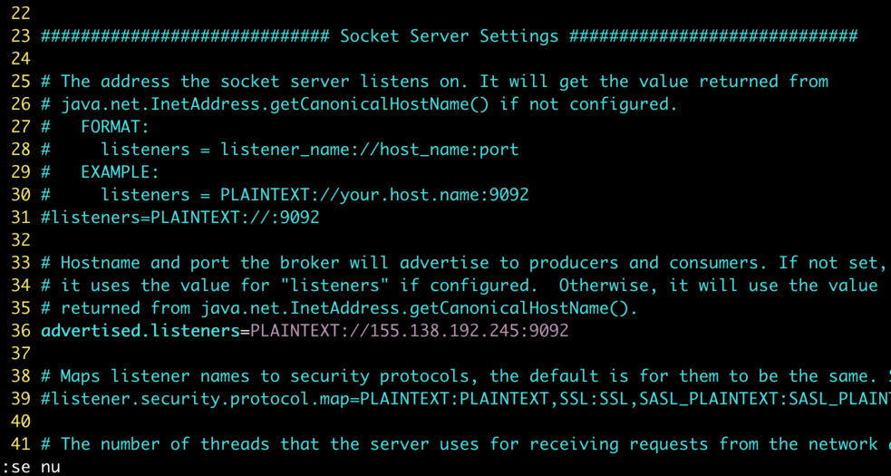
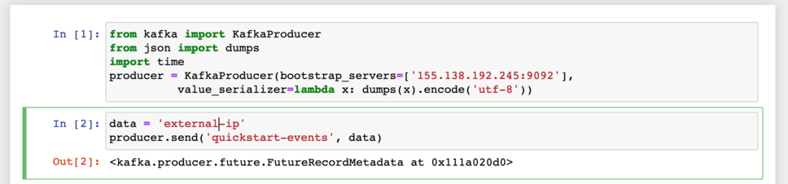
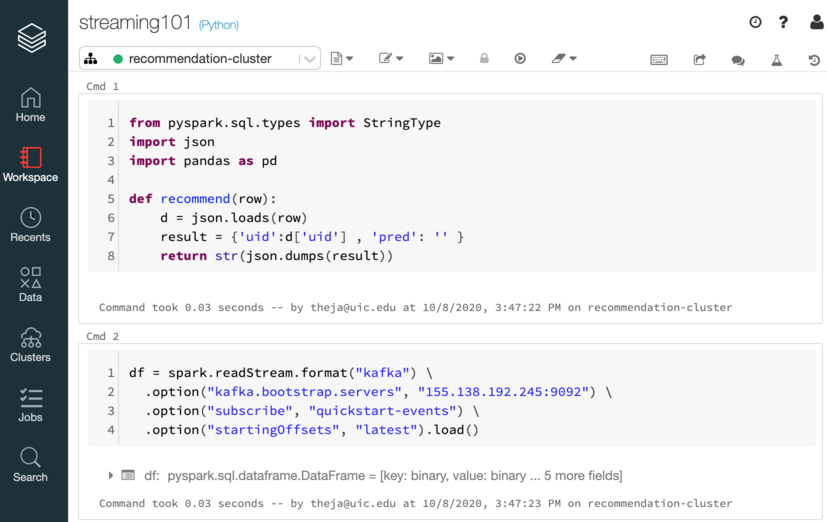
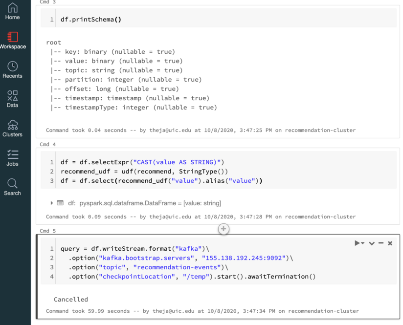

#### Background

 - Spark Streaming relies on the underlying building blocks of spark (which allow for fast distributed processing of large datasets) to allow for streaming operations/transformations. 
 - In its core, it reads data (thus a consumer) in fixed small sizes and then converts them to RDDs for processing.
 - As a benefit, this type of interfacing allows Spark Streaming to utilize essentially the same codebase written for a batch pipeline with minor modifications.
 - As a downside, there is latency incurred because of only processing at the level of a fixed size of incoming data.
 - Spark streaming has interfaces with:
 	- Kafka (which we will see below)
 	- Apache Flume (see exercises)
 	- Kinesis (see exercises)
 	- ...


#### Business Objective

- The business objective of a streaming PySpark based ML deployment pipeline is to ensure predictions do not go stale.

#### Our Setup

- The general idea is that a pyspark function reads input from an *input stream* (we will use Kafka) and applies a model (or any transformation) and sends its output to an *output stream*.

- Much of the complexity while going from batch to streaming setting is hidden behind the scenes letting data science professionals leverage this infrastructure to serve streaming requirements.

- We will set up a streaming pipeline which fetches data from a Kafka topic, uses our prediction model and write the output to a new topic. And this is continuously run till terminated explicitly.

- *Another key benefit* is that if we stop our pyspark code for changes or updates, the rest of the system need not be touched.

#### Kafka

 - We will edit the Kafka config in config/server.properties to use the external IP. We can do this in the same screen session we had started Kafka process in. We should terminate it first using `Ctrl+c`.

```bash
root@vultr:~/kafka_2.13-2.6.0# vim config/server.properties
```



 - Lets also allow incoming access to port 9092 (note that this is risky as we running as the root user). 

```bash
root@vultr:~/kafka_2.13-2.6.0# ufw allow 9092
Rule added
Rule added (v6)
root@vultr:~/kafka_2.13-2.6.0# ufw status verbose
Status: active
Logging: on (low)
Default: deny (incoming), allow (outgoing), disabled (routed)
New profiles: skip

To                         Action      From
--                         ------      ----
22                         ALLOW IN    Anywhere
9092                       ALLOW IN    Anywhere
22 (v6)                    ALLOW IN    Anywhere (v6)
9092 (v6)                  ALLOW IN    Anywhere (v6)

root@vultr:~/kafka_2.13-2.6.0#
```

 - Now start the Kafka process as before.

 - We can check that access to Kafka works by using a local jupyter notebook (different from above!) and using the same code as before with the IP address explicitly specified.



 - We should be able to see the message on the consumer terminal we had set up earlier:

```bash
root@vultr:~/kafka_2.13-2.6.0# bin/kafka-console-consumer.sh --topic quickstart-events --from-beginning --bootstrap-server localhost:9092
Hello
Theja
["Hello from python", "Theja from python"]
{"name":"Theja"}
"external-ip"
```


 - Lets create a second topic to output our recommendations. Got to the terminal where did the describe step above.

```bash
root@vultr:~/kafka_2.13-2.6.0# bin/kafka-topics.sh --describe --topic quickstart-events --bootstrap-server localhost:9092
Topic: quickstart-events        PartitionCount: 1       ReplicationFactor: 1    Configs: segment.bytes=1073741824
        Topic: quickstart-events        Partition: 0    Leader: 0       Replicas: 0     Isr: 0
```

 - Run the create topic command from above with a new topic name.

```bash
root@vultr:~/kafka_2.13-2.6.0# bin/kafka-topics.sh --create --topic recommendation-events --bootstrap-server localhost:9092
Created topic recommendation-events.
```

 - [Login to Databricks](https://community.cloud.databricks.com/login.html) and start a new notebook.

 - We will first test streaming.

	- Download notebook as [ipynb](streaming101.ipynb) or [py](streaming101.py). You can also view it as a [html](streaming101).






 - In the notebook above, we have created a consumer as well as a producer.
 - The consumer is reading in data from the `quickstart-events` topic.
 - The producer is dumping dummy output to the `recommendation-events` topic.

#### Integrating with the Recommendation Model

 - We will reuse the code that trains the surprise-lib SVD model (essentially the basic matrix factorization) and then switch to making predictions given `uid` from an upstream producer.

	- Download notebook as [ipynb](streaming_recs.ipynb) or [py](streaming_recs.py). You can also view it as a [html](streaming_recs).


 - We produce a simple event such as `{'uid':196}` from our local jupyter notebook (for example) and send it to the Kafka cluster as part of the first topic.
 - This is then read by the pyspark notebook consumer.
 - The top movies for the uid are then retrieved and then sent to the second topic in the Kafka cluster.
 - An app downstream can be a consumer of this message from Kafka.

#### Remarks

 - We have only scratched the surface of the spark ecosystem and stream processing. Streaming pipelines are increasingly becoming popular and a central part of many analytics focused organizations.
 - Being acquainted with what these technologies bring to the table is useful and being able to scale ML modeling and deployment using them is a very powerful skill to have.
 